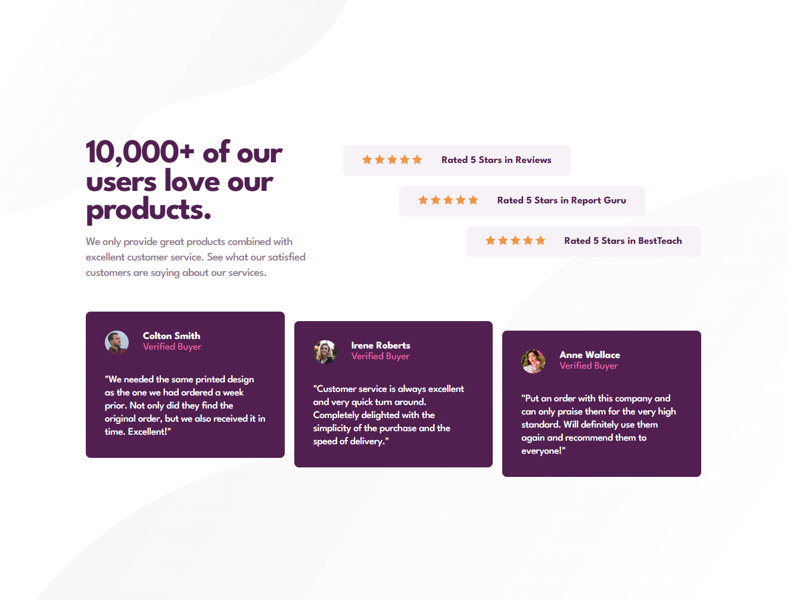

# Frontend Mentor - Social proof section solution

This is a solution to the [Social proof section challenge on Frontend Mentor](https://www.frontendmentor.io/challenges/social-proof-section-6e0qTv_bA). Frontend Mentor challenges help you improve your coding skills by building realistic projects. 

## Overview

### The challenge

Users should be able to:

- View the optimal layout for the section depending on their device's screen size

### Screenshot

### Links

- Solution URL: [GitHub](https://github.com/rradiohysteria/social-proof-section)
- Live Site URL: [GitHub Pages](https://rradiohysteria.github.io/social-proof-section/)

## My process

### Built with

- Semantic HTML5 markup
- SASS
- CSS custom properties
- Flexbox
- CSS Grid
- Mobile-first workflow

## Notes

The elements in the `.reviews` container are offset using the `align-self` property. While in a CSS grid, an item has both `align-self` and `justify-self`, Flexbox only allows horizontal alignment. This is why in the `.testimonials` section, we have to use the `transform: translateY()` declaration.